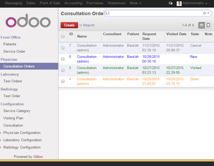

# HealthCare Management System
Manage Patients Information, Plan and Create Medical Services Order, Track Orders on another Medical Modules

it integrates with odoo v9, and consist of many modules which work in different Departments of the Hospital like Front Office, Laboratory,etc.
## Front Office
Service Definition and Configuration, Patient Registration, Medical Services Orders and Invoicing.

 
Drive your HealthCare operations from Patient Registration, Medical Services Order to invoices with all the information you need, keep all information about patients in the electronic patient folder and can easy accessible. automate invoicing and manage services order on workflow depending on hospital policy.
### Patient Registration
Register all information about patient.

### Medical Services Orders
Request Medical Services Order to any patient, the medical service order may be consultation Order, Investigation Order, procedure or Surgery.
                

## Physician Module
Consultation Work List

On this Module Doctor can make the following:
- Store Patient Diagnosis.
- Request Laboratory Tests.
- Request Radiology Tests.
- Request Procedures.
- Request Drugs.

### Define Flexible Master Data

Define Consultation, Diagnosis and Specialization
The Master Data Definition very easy, Configure product with consultant to define Consultation. Define Standard Diagnosis for all disease and define Specialization.

### Get Flexibility In Consultation Operations

All Doctors Defining on Consultation must have login user to view Consultation Request when login by this user.
on the Consultation Requests Screen, the doctor can create case sheet for the order which contain Diagnosis,
Examination Request, Drugs Order, Chief Compliant, and more Fields.
### Easy to Manage Case Sheet

The Doctor select Provisional and Final Diagnosis by selecting from Diagnosis List,
Create Examination Request and send them to specified Department( Laboratory, Radiology and Speciality Units),
Create Drugs Order by searching on the Drugs List.
Fill Other Fields like Chief Compliant, History,etc.
#### Diagnosis
Easy to select diagnosis.
#### Examination Order

get Flexability on Examination Order.
### Fully Integrated
Don't lose time looking for Patient related information;
they are all conveniently accessible when do you need.
Get access to examination request to show examination results, reports.
and access to patient folder to view patient history, etc.                
## Laboratory Module
Test Definition, Investigation Requests, Results Entry, Printing Reports

This module allows to Manage Laboratory Operations inside Odoo such as:
- Define Flexible Master Data.
- View Laboratory Test Order of the Patient.
- Enter Results for ordering Tests and Printing it.
- Dispatch The Report of Results to the patient.
### Define Flexible Master Data
Laboratory Master Data Definition Test, Test Components, Normal Range of Results
The Master Data Definition very easy, On one Screen you can Define the Test and Create All Component to the test,
Add Normal Range of Results depending on Patient Gender(Male, Female), Patient Age. and Add Default values.
Antibiotic Definition.

### Get Flexibility In All Operations

Manage all Test Requisition start of Sample Collection to Dispatch Report.
Entering Results and verified it, and Print report of results.

view Consultation Request, Case sheet, Drug Orders, Examination Order, Add Diagnosis and view Patient Folder.
-	Laboratory: Test Definition, view Laboratory Test Request, Enter Results and Print Results Report.
-	Radiology: Test Definition, view Radiology Test Request, Writing Reports

